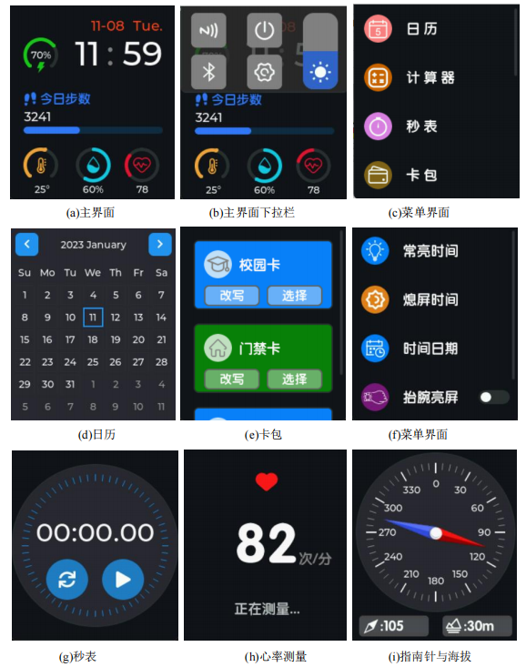
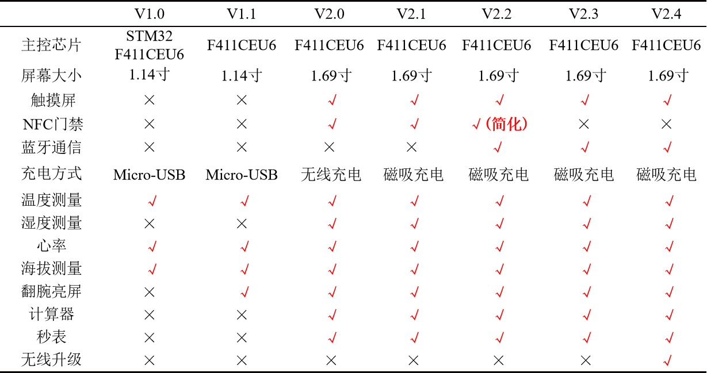
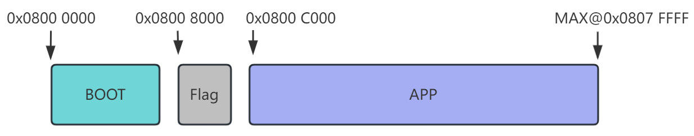
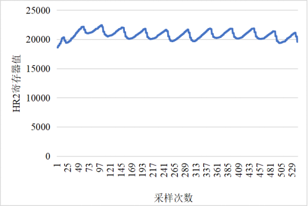
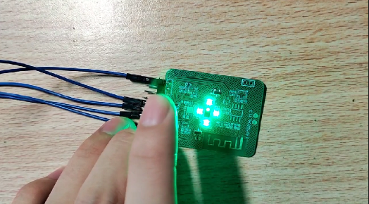
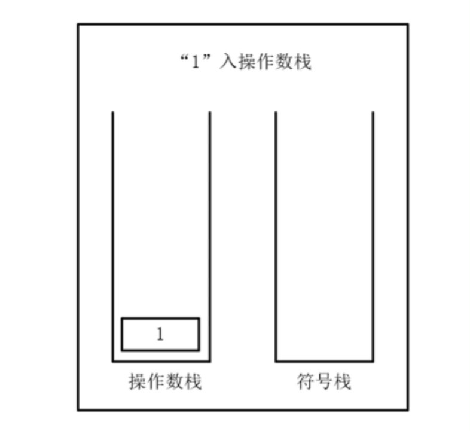

<p align="right">
  <b>中文</b> | <a href="./README_Eng.md">English</a> 
</p>

<h1 align="center">OV-Watch — 个人学习与二次开发</h1>

<div align=center>
    
    
    
    
    
    
</div>

<br>

> **原项目地址**: [No-Chicken/OV-Watch](https://github.com/No-Chicken/OV-Watch)
>
> 本项目是 [OV-Watch v2.4.4](https://github.com/No-Chicken/OV-Watch) 的个人学习分支，在深入研究原项目架构的基础上，新增了**长按按键切换表盘**功能。

<br>

---

## :book: 关于本项目

这是一份基于开源智能手表项目 **OV-Watch**（作者：不吃油炸鸡 / No-Chicken）的个人学习与实践记录。原项目是一块功能完备的 STM32F411CEU6 智能手表，集成了 FreeRTOS 实时操作系统、LVGL v8.2 图形界面、多种传感器（心率、血氧、温湿度、气压、地磁、IMU）以及蓝牙通信功能。

在掌握原项目的整体架构、任务调度机制、页面管理逻辑和 LVGL 图形开发方式之后，我独立设计并实现了一个新功能：**长按按键循环切换表盘**。

<p align="center">
    
</p>

<p align="center">
    
</p>

---

## :seedling: 学习过程

### 第一阶段：环境搭建与项目理解

- 搭建 Keil MDK-ARM 开发环境，配置 STM32F411CEU6 的 HAL 库和 CMSIS-RTOS v2
- 理解 BootLoader + APP 双区固件架构（IAP OTA 蓝牙升级）
- 通过 STM32CubeMX 的 `.ioc` 文件梳理外设配置（GPIO、SPI、I2C、DMA、TIM、RTC）
- 仿真运行 LVGL 桌面模拟器，验证 UI 逻辑

### 第二阶段：代码架构分析

逐层分析项目代码结构：

| 层级 | 路径 | 学习要点 |
|------|------|----------|
| BSP 驱动层 | `BSP/KEY/`、`BSP/LCD/`、`BSP/BL24C02/` | 按键扫描状态机、ST7789 SPI+DMA 刷屏、I2C EEPROM 读写 |
| 硬件抽象层 | `User/Func/Src/HWDataAccess.c` | `HWInterface` 结构体设计模式：用函数指针封装硬件接口，方便 PC 仿真移植 |
| 页面管理器 | `User/Func/Src/PageManager.c` | 栈式页面导航（最大深度 6），`Page_t` 结构体统一 init/deinit 接口 |
| 任务系统 | `User/Tasks/Src/` | 12 个 FreeRTOS 任务的职责划分、消息队列通信、优先级设计 |
| UI 层 | `User/GUI_App/Screens/Src/` | LVGL 控件布局、定时器刷新、手势事件处理 |
| 中断处理 | `Core/Src/stm32f4xx_it.c` | TIM1 长按关机检测（~3 秒）、EXTI 按键中断、USART1 IDLE 中断接收蓝牙数据 |

### 第三阶段：关键模块深入

- **按键系统**：`KeyScan()` 采用非阻塞状态机（key_up / key_down 标志 + 3ms 消抖），按键松开时才返回键值
- **页面栈**：`Page_Home` 始终在栈底，`Page_Back()` 向上弹出，`Page_Back_Bottom()` 直接回到栈底
- **EEPROM 布局**：`[0x00-0x01]` 魔数校验 → `[0x10-0x11]` 用户设置 → `[0x20-0x22]` 日期+步数
- **LVGL 移植**：双半屏缓冲（DMA 刷新），触摸输入通过 CST816 I2C 电容屏

---

## :hammer: 二次开发：长按切换表盘

### 需求分析

原项目只有一个表盘样式（`ui_HomePage`），用户无法切换。希望在**不破坏原有按键逻辑**的前提下，通过**长按 KEY2 按键**来循环切换不同的表盘。

### 按键分配设计

| 操作 | KEY1 | KEY2 |
|------|------|------|
| 短按（< 1s） | 返回上一页 | HomePage → 休眠 / 其他页面 → 回主页 |
| 长按（>= 1s） | 3 秒关机（原有） | **切换表盘（新增）** |

### 修改的文件清单（12 个文件）

#### 修改的源文件（8 个）

| 文件 | 修改内容 |
|------|----------|
| `BSP/KEY/key.h` | 新增 `KEY_LONG_PRESS_MS` 阈值宏（1000ms），声明 `KeyScan_GetCurrentKey()` 和 `KeyScan_GetHoldTime()` |
| `BSP/KEY/key.c` | 新增 `key_hold_time` / `key_current` 静态变量追踪按键按住时长；在 `KeyScan()` 状态机中嵌入计数逻辑 |
| `User/Tasks/Src/user_KeyTask.c` | 用 `KeyScan_GetCurrentKey()` + `KeyScan_GetHoldTime()` 检测 KEY2 长按；`key2_long_handled` 标志防止长按释放后误触短按；长按发送 `keystr=3` |
| `User/Tasks/Src/user_ScrRenewTask.c` | 新增 `keystr == 3` 分支，调用 `WatchFace_SwitchToNext()` |
| `User/Func/Inc/PageManager.h` | 消除循环依赖：`#include` 从 `ui.h` 改为 `lvgl/lvgl.h` |
| `User/Func/Src/PageManager.c` | `Pages_init()` 改用 `WatchFace_GetCurrentPage()` 动态获取表盘；`Page_Back()` 栈空恢复时同步使用当前表盘 |
| `User/GUI_App/ui.h` | 新增 `#include "../Func/Inc/WatchFaceManager.h"` |
| `User/Tasks/Src/user_HardwareInitTask.c` | 在 EEPROM 初始化后调用 `WatchFace_Init()` 加载上次的表盘设置 |

#### 新建的源文件（4 个）

| 文件 | 说明 |
|------|------|
| `User/Func/Inc/WatchFaceManager.h` | 表盘管理器头文件：定义最大表盘数 `WF_MAX_COUNT=5`，EEPROM 存储地址 `0x12` |
| `User/Func/Src/WatchFaceManager.c` | 管理 `WatchFaces[]` 数组（`Page_t` 指针列表），切换时 deinit 旧表盘 → 更新索引 → init 新表盘 → `lv_scr_load_anim()` 动画加载 → EEPROM 持久化 |
| `User/GUI_App/Screens/Inc/ui_HomePage2.h` | 第二表盘头文件（简洁大字风格） |
| `User/GUI_App/Screens/Src/ui_HomePage2.c` | 第二表盘实现：居中 Cuyuan80 大字时间、日期、顶部电量、底部步数+心率，右滑手势进菜单 |

### 技术要点总结

```
┌─────────────────────────────────────────────────────┐
│  KeyTask (1ms 循环)                                  │
│  ├─ KeyScan(0) → 返回键值 (0/1/2)                    │
│  ├─ KeyScan_GetCurrentKey() → 当前按住哪个键         │
│  ├─ KeyScan_GetHoldTime() → 已按住多久 (ms)          │
│  │                                                    │
│  │  KEY2 按住 >= 1000ms 且 HomePage → keystr=3       │
│  └──────────┬─────────────────────────────────────── │
│             │ Key_MessageQueue                        │
│  ┌──────────▼─────────────────────────────────────── │
│  │ ScrRenewTask (消息处理)                            │
│  │  keystr=3 → WatchFace_SwitchToNext()              │
│  └──────────┬─────────────────────────────────────── │
│             │                                          │
│  ┌──────────▼─────────────────────────────────────── │
│  │ WatchFaceManager                                   │
│  │  ├─ deinit 当前表盘                                 │
│  │  ├─ current = (current + 1) % count                │
│  │  ├─ 替换 PageStack.pages[0]                         │
│  │  ├─ init 新表盘                                     │
│  │  ├─ lv_scr_load_anim(MOVE_LEFT) 动画加载           │
│  │  └─ SettingSave() → EEPROM 0x12 持久化            │
│  └────────────────────────────────────────────────── │
└─────────────────────────────────────────────────────┘
```

> **扩展指南**：想新增表盘？只需三步 — 
> 1. 新建 `ui_HomePage3.c/h`（定义 `Page_t Page_Home3`）
> 2. 在 `WatchFaceManager.c` 的 `WatchFaces[]` 数组中注册 `&Page_Home3`
> 3. 重新编译即可，无需修改其他任何文件。

---

## :bookmark_tabs: 原项目功能表

<p align="center">
    
</p>

---

## :file_folder: 软件架构

<p align="center">
    
</p>

<p align="center">
    
</p>

### FreeRTOS 任务一览

| 任务 | 栈大小 | 优先级 | 职责 |
|------|--------|--------|------|
| HardwareInitTask | 1280×4 | High3 | 一次性初始化所有硬件外设、传感器、EEPROM、LVGL，完成后自删除 |
| LvHandlerTask | 3072×4 | Low | 每 1ms 调用 `lv_task_handler()` 驱动 LVGL 刷新 |
| WDOGFeedTask | 128×4 | High2 | 每 100ms 喂狗 |
| IdleEnterTask | 128×4 | High | 管理屏幕自动熄灭（空闲计时） |
| StopEnterTask | 2048×4 | High1 | 管理 STOP 睡眠模式（挂起任务 → WFI → RTC/按键唤醒） |
| KeyTask | 128×4 | Normal | 每 1ms 扫描按键，发送消息到队列 |
| ScrRenewTask | 1280×4 | Low1 | 接收按键消息，执行页面导航（返回/回主页/切换表盘） |
| SensorDataTask | 640×4 | Low1 | 每 500ms 更新传感器数据（电量/步数/温湿度） |
| HRDataTask | 640×4 | Low1 | 心率数据更新与算法计算 |
| ChargPageEnterTask | 1280×4 | Low1 | 检测充电状态，显示充电页面 |
| MessageSendTask | 640×4 | Low1 | 蓝牙消息收发处理 |
| MPUCheckTask | 384×4 | Low2 | 每 300ms 检测 MPU6050 手腕姿态 |
| DataSaveTask | 640×4 | Low2 | 设置变更时持久化到 EEPROM |

---

## :computer: 原项目软件设计细节

### 1. 低功耗设计

- **运行模式**：70-80mA（全功能运行）
- **睡眠模式**：~1mA（MCU 进入 STOP 模式，MPU6050 仍在计步，RTC 定时唤醒检测抬腕）
- **关机模式**：~0mA（TPS63020 DCDC 关闭使能，仅 VBAT 供电 RTC）

<p align="center">
    
</p>

### 2. 心率检测

使用 EM7028 PPG 传感器，自行实现的简易峰值检测算法替代官方库，提升计算速度。

<p align="center">
    
</p>

### 3. 页面切换逻辑

使用栈式页面管理（最大深度 6），`Page_t` 结构体封装 `init` / `deinit` 回调，配合 `lv_scr_load_anim()` 实现带滑入动画的页面切换。

### 4. 计算器实现

经典双栈算法：操作数栈 + 运算符栈，处理优先级比较与小数运算。

<p align="center">
    
</p>

---

## :camera: 项目图片资源说明

以下是 `images/` 目录中的全部图片资源及其用途：

| 图片 | 说明 |
|------|------|
| `演示动图.gif` | 手表功能演示动画 |
| `界面.jpg` | 主界面 / 表盘截图 |
| `功能表.jpg` | 全部功能列表一览 |
| `software structure.jpg` | 软件架构层次图 |
| `storage.jpg` | 存储（EEPROM）布局说明 |
| `实物图.jpg` / `实物图2.png` / `实物图3.png` | 手表实物照片（多角度） |
| `front.jpg` / `back.jpg` | 手表正面 / 背面 PCB 照片 |
| `心率实物图.png` | 心率检测功能实物展示 |
| `EM7028的测量曲线.jpg` | EM7028 PPG 传感器信号波形 |
| `LVGL_sim.jpg` | LVGL Windows/VSCode 仿真截图 |
| `boot升级界面.jpg` | BootLoader OTA 升级界面 |
| `蓝牙设置.jpg` / `蓝牙配对.jpg` | 蓝牙配置与配对截图 |
| `send ymodem.jpg` | YMODEM 协议发送界面 |
| `SecureCRT.jpg` | SecureCRT 串口调试截图 |
| `ST-LINK download.jpg` | ST-LINK 烧录配置截图 |
| `计算.gif` | 计算器双栈算法动图演示 |

---

## :black_nib: 烧录说明

建议直接使用 `Firmware/` 目录中的预编译固件。自行编译需要配置 Keil MDK-ARM 工程。

`Software/` 目录包含两个 Keil 工程：
- `IAP_F411/` — BootLoader（IAP 在线升级，蓝牙 YMODEM）
- `OV_Watch/` — APP 主程序（偏移地址 0x0000C000）

详细步骤见 [Firmware/README.md](./Firmware/README.md)

---

## :link: 相关链接

<p align="center">
    <a href="https://github.com/No-Chicken/OV-Watch">原项目 GitHub</a> |
    <a href="https://space.bilibili.com/34154740">作者 Bilibili</a> |
    <a href="https://oshwhub.com/no_chicken/zhi-neng-shou-biao-OV-Watch_V2.2">硬件开源</a> |
    <a href="https://no-chicken.com">说明手册</a>
</p>

---

## :pencil: 开源协议

本项目基于 [GPL 3.0](./LICENSE) 协议开源。原项目版权归 [No-Chicken (不吃油炸鸡)](https://github.com/No-Chicken) 所有。二次开发部分（长按切换表盘功能）遵循相同协议。
